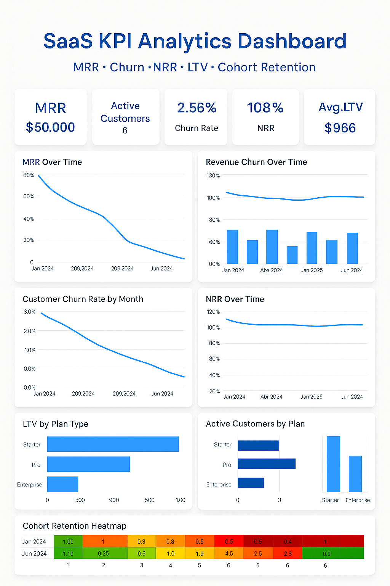
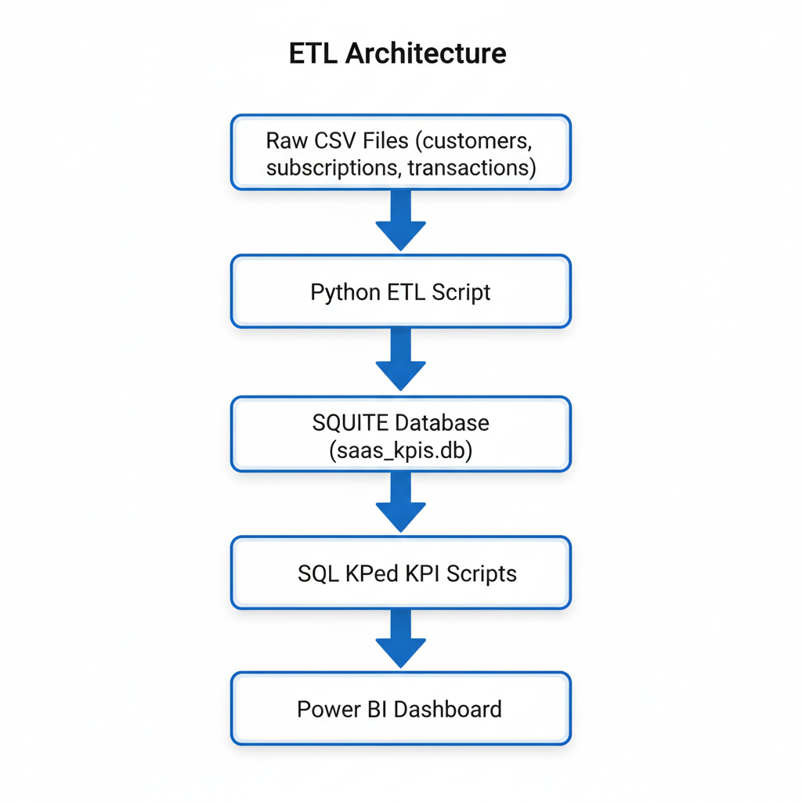

<div align="center">

<h1>📊 SaaS KPI Analytics Platform</h1>

<p><b>Python → SQL → ETL Pipeline → KPI Engine → Power BI Dashboard</b></p>


<br><br>

<h3>Developed By</h3>
<h2><b>Ayuresh Anil Fendar</b></h2>
<h4>📌 Data Engineer | Analytics | ETL Pipelines</h4>

<a href="mailto:ayureshfendar2003@gmail.com">

</a>

</div>


## Goal

This project is an end-to-end analytics system for SaaS financial metrics such as **MRR, ARR, Churn, NRR, Customer Retention, and LTV**.  
It simulates realistic SaaS subscription data, processes it via a Python ETL pipeline, stores it in SQLite, calculates KPIs using SQL, and visualizes insights in **Power BI**.

This project demonstrates strong skills in **data modeling, SQL analytics, Python scripting, KPI computation, and BI dashboarding**—similar to the expectations of SaaS FP&A and analytics platforms like **Drivetrain**.

---
## Dashboard Preview



## Key Visuals Included
- MRR Over Time  
- Customer Churn Trend  
- Revenue Churn  
- Net Revenue Retention (NRR)  
- Lifetime Value (LTV) by Segment  
- Cohort Retention Heatmap  
## 📊 Key Features

### ✅ **1. Data Pipeline (Python ETL)**
- Loads CSV data (customers, subscriptions, transactions)
- Cleans & transforms datasets
- Inserts data into a relational SQLite database
- Includes reproducible ETL workflows

### ✅ **2. SaaS KPI Engine (SQL + Python)**
The platform computes:

| KPI | Description |
|------|-------------|
| **MRR** | Monthly Recurring Revenue |
| **ARR** | Annual Recurring Revenue |
| **Active Customers** | Customers with active subscriptions |
| **Customer Churn** | Percentage of customers that churn each month |
| **Revenue Churn** | Lost MRR due to cancellations |
| **NRR (Net Revenue Retention)** | Expansion - contraction - churn + existing revenue |
| **LTV (Lifetime Value)** | ARPU / Churn Rate |
| **Cohort Retention** | Monthly retention pattern of cohorts |

### KPI Scripts:
- `run_kpis.py`
- `run_active_customers.py`
- `run_customer_churn.py`
- `run_revenue_churn.py`
- `run_nrr.py`
- `run_segment_ltv.py`
- `run_cohort_retention.py`

---

## 📁 Project Structure
```
saas-kpis/
│
├── data/
│ ├── customers.csv
│ ├── subscriptions.csv
│ ├── transactions.csv
│ ├── monthly_mrr.csv
│ ├── active_customers.csv
│ ├── revenue_churn.csv
│ ├── cohort_retention.csv
│
├── powerbi/
│ └── SaaS_KPI_Report.pbix
│
├── scripts/
│ ├── etl.py
│ ├── run_kpis.py
│ ├── run_active_customers.py
│ ├── run_customer_churn.py
│ ├── run_revenue_churn.py
│ ├── run_nrr.py
│ ├── run_segment_ltv.py
│ ├── run_cohort_retention.py
│
├── requirements.txt
├── .gitignore
└── README.md

```


---

## ETL Architecture

Flowchart TD




## Power BI Dashboard (KPIs Included)
   
1️⃣ MRR Trend

Line chart showing progressive recurring revenue growth.

2️⃣ Customer Churn Rate

Monthly churn with customer-level insights.

3️⃣ Revenue Churn

Churned MRR per month.

4️⃣ Net Revenue Retention (NRR)

Shows expansion revenue vs churn losses.

5️⃣ LTV by Segment

Starter vs Pro vs Enterprise LTV.

6️⃣ Cohort Retention Heatmap

Professional SaaS metric showing retention over time.

## Sample SQL Logic (MRR Calculation)
```
WITH months AS (
    SELECT DATE('2024-01-01') AS month_start UNION ALL
    SELECT DATE('2024-02-01') UNION ALL
    SELECT DATE('2024-03-01') UNION ALL
    SELECT DATE('2024-04-01') UNION ALL
    SELECT DATE('2024-05-01') UNION ALL
    SELECT DATE('2024-06-01')
)
SELECT
    m.month_start,
    SUM(s.monthly_price) AS mrr
FROM months m
JOIN subscriptions s
    ON DATE(s.start_date) <= DATE(m.month_start, '+1 month', '-1 day')
    AND (s.end_date IS NULL OR DATE(s.end_date) >= DATE(m.month_start))
GROUP BY m.month_start;
```
## Technology Stack
Languages & Tools

Python (Pandas, SQLAlchemy)

SQLite (SQL)

Power BI (Dashboarding)

VS Code

## Libraries

`pandas`

`sqlalchemy`

`numpy`

## Installation
1️⃣ Clone the repository:
```
git clone https://github.com/your-username/saas-kpis.git
cd saas-kpis
```
2️⃣ Install dependencies:
```
pip install -r requirements.txt
```
3️⃣ Run ETL:
```
python scripts/etl.py
```
4️⃣ Generate KPIs:
```
python scripts/run_kpis.py
...
python scripts/run_nrr.py
```
5️⃣ Open Power BI Dashboard:
```
powerbi/SaaS_KPI_Report.pbix
```
##  Business Insights (Sample)

Starter plan has highest LTV, indicating strong retention and upgrade potential.

Enterprise churn is high, signaling onboarding or product-fit issues.

NRR > 100% in multiple months shows healthy expansion revenue.

Cohort retention decreases predictably, matching normal SaaS behavior.

These insights demonstrate real-world SaaS financial analysis capabilities.

## Ideal For

Data Analyst Portfolio

Business Analyst / FP&A roles

SaaS Analytics Interview Prep

ETL + SQL + BI End-to-End Showcase

Drivetrain, SaaS startups, FinTech roles

 ## Acknowledgements

This project was built as a learning and interview-preparation exercise with inspiration from SaaS analytics platforms and industry-standard KPI frameworks.


---


